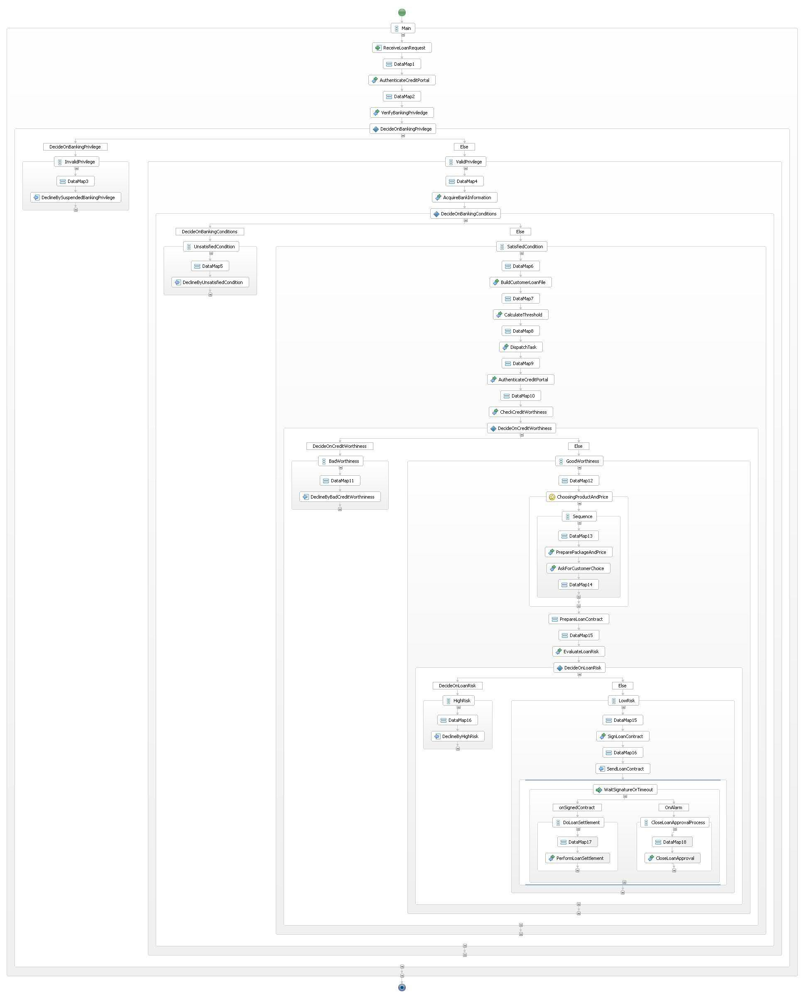

# Loan Approval WS-BPEL Business Process

This project implements the Loan Approval Process using WS-BPEL 2.0 and WSDL 1.1. The implementation is deployable in a BPEL engine. I have developed and tested the process with some versions of [Apache ODE](http://ode.apache.org) 1.3.x.



The implementation under the folder `resources` consists of a `.bpel` file that describes the main business logic of the process and a number of `.wsdl` files that specifies various functions provided by different Web services.

## Requirements

  - [Apache ODE 1.3.x](http://ode.apache.org) (please see the [notes on Apache ODE](#apache-ode))
  - [Apache Ant](https://ant.apache.org)

## Deploying/Running

The local path to the Apache ODE repository is defined in the file `project.properties`. This value must reflect the actual location of Apache ODE in your host/computer.

```properties
ode.deploy.dir=/usr/local/opt/tomcat/libexec/webapps/ode/WEB-INF/processes
```

### Compiling

```sh
ant process.compile
```

### Deploying
```sh
ant process.deploy
```

### Packaging

```sh
ant process.package
```

## Notes

* The legal delay before the customer makes a decision is current set at `5` seconds.

```xml
<bp:wait
    name="LegalDelayForThinking">
    <bp:for>'P0Y0M0DT0H0M5S'</bp:for>
</bp:wait>
```

* The legal time-out is currently set at `30` seconds. 

```xml
<!-- Legal time-out -->
<bp:onAlarm>
	<bp:for>'P0Y0M0DT0H0M30S'</bp:for>
	...	
```

These values are merely used for demonstrating purposes only. 

### Apache ODE Engines <a name="apache-ode"></a>

#### Apache ODE 1.3.3

If a process has multiple consecutive invocations to a service, that will raise an exception via Apache Axis 2 "`axis2.AxisFault`" regarding _"two services cannot have same name"_ (see https://issues.apache.org/jira/browse/ODE-647 for more information).

Applying the corresponding patch and rebuilding Apache ODE from its source will fix the issue.

### Apache ODE 1.3.4 & 1.3.5

These two engines throw a rather cryptic error message `java.util.regex.PatternSyntaxException: Dangling meta character '*' near index 0` as following.

```
09:38:42,476 ERROR [ExternalService] Error sending message (mex={PartnerRoleMex#hqejbhcnphrdwjpnhpo8vp [PID {urn:com:westbank:bpel:LoanApproval:2019:01}LoanApproval-1] calling org.apache.ode.bpel.epr.WSAEndpoint@1bb5f13a.update(...) Status ASYNC}): Dangling meta character '*' near index 0
*.local
^
java.util.regex.PatternSyntaxException: Dangling meta character '*' near index 0
*.local
^
	at java.util.regex.Pattern.error(Pattern.java:1957)
	at java.util.regex.Pattern.sequence(Pattern.java:2125)
	at java.util.regex.Pattern.expr(Pattern.java:1998)
	at java.util.regex.Pattern.compile(Pattern.java:1698)
	at java.util.regex.Pattern.<init>(Pattern.java:1351)
	at java.util.regex.Pattern.compile(Pattern.java:1028)
	at java.util.regex.Pattern.matches(Pattern.java:1133)
	at java.lang.String.matches(String.java:2121)
	at org.apache.axis2.transport.http.ProxyConfiguration.validateNonProxyHosts(ProxyConfiguration.java:261)
	at org.apache.axis2.transport.http.ProxyConfiguration.isProxyEnabled(ProxyConfiguration.java:223)
	at org.apache.axis2.transport.http.AbstractHTTPSender.getHostConfiguration(AbstractHTTPSender.java:271)
	at org.apache.axis2.transport.http.AbstractHTTPSender.executeMethod(AbstractHTTPSender.java:502)
	at org.apache.axis2.transport.http.HTTPSender.sendViaPost(HTTPSender.java:191)
	at org.apache.axis2.transport.http.HTTPSender.send(HTTPSender.java:77)
	at org.apache.axis2.transport.http.CommonsHTTPTransportSender.writeMessageWithCommons(CommonsHTTPTransportSender.java:327)
	at org.apache.axis2.transport.http.CommonsHTTPTransportSender.invoke(CommonsHTTPTransportSender.java:206)
	at org.apache.axis2.engine.AxisEngine.send(AxisEngine.java:396)
	at org.apache.axis2.description.OutInAxisOperationClient.send(OutInAxisOperation.java:374)
	at org.apache.axis2.description.OutInAxisOperationClient.executeImpl(OutInAxisOperation.java:211)
	at org.apache.axis2.client.OperationClient.execute(OperationClient.java:163)
	at org.apache.ode.axis2.SoapExternalService$1$1.call(SoapExternalService.java:206)
	at java.util.concurrent.FutureTask.run(FutureTask.java:266)
	at java.util.concurrent.ThreadPoolExecutor.runWorker(ThreadPoolExecutor.java:1149)
	at java.util.concurrent.ThreadPoolExecutor$Worker.run(ThreadPoolExecutor.java:624)
	at java.lang.Thread.run(Thread.java:748)
```
#### Apache ODE 1.3.6 & 1.3.7

These engines work perfectly fine for the Loan Approval BPEL process. There are no known errors/bugs so far.

#### Apache ODE 1.3.8

The XMl messages sent by Apache ODE 1.3.8 to LoanFile services are broken. This issue does not happen with other versions.

